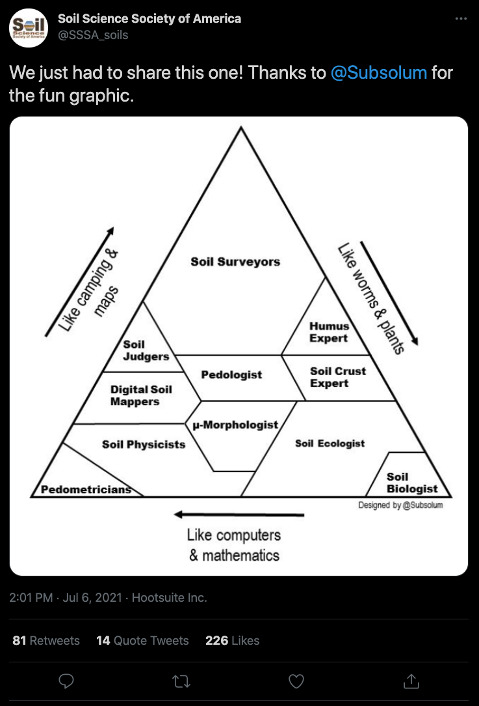

```{r setup, include=FALSE}
library(flipbookr)
library(tidyverse)
knitr::opts_chunk$set(fig.width = 5, message = FALSE, 
                      warning = FALSE, comment = "", 
                      cache = F, fig.retina = 5)
```

```{css, eval = TRUE, echo = FALSE}
.remark-code{line-height: 1.2; font-size: 70%}
@media print {
  .has-continuation {
    display: block;
  }
}
```
---
name: about-me
class: about-me-slide, inverse, middle, center

# About me


*Sara Acevedo*

*Dr. (c) Ciencias de la Ingeniería*
*Msc. Soils and Biogeochemistry*

.fade[Pontificia Universidad Católica de Chile<br>Santiago, Chile]

[`r icons::fontawesome("link")` saryace.github.io](https://saryace.github.io)
[`r icons::fontawesome("twitter")` @saryace](https://twitter.com/saryace)
[`r icons::icon_style(icons::fontawesome("github"), scale = 1)` @Saryace](https://github.com/Saryace)
---
name: about-me
class: about-me-slide, inverse, middle, center

# About Soil Biophysics Lab


*Soil Biophysics Lab*

*PI: Dr. Carlos Bonilla*

.fade[Pontificia Universidad Católica de Chile<br>Santiago, Chile]

[`r icons::fontawesome("link")` biofisica.ing.puc.cl](https://biofisica.ing.puc.cl)
[`r icons::fontawesome("twitter")` @soilbiophysics1](https://twitter.com/soilbiophysics1)
[`r icons::icon_style(icons::fontawesome("instagram"), scale = 1)` @soilbiophysicslab](https://www.instagram.com/soilbiophysicslab)
---

class: inverse

## Soil Biophysics Laboratory

```{r,out.width='100%', fig.height=5,echo=FALSE,warning=FALSE,message=FALSE}
library(leaflet)
library(dplyr)

leaflet() %>%
  addTiles() %>%
  addPopups(lng = -70.6149164,
             lat =  -33.4995699,
             popup = "Soil Biophysics Lab",
             options = popupOptions(closeButton = FALSE)) %>% 
  setView(lng = -70.6149164,
          lat =  -33.4995699,
          zoom = 17)

```
---
class: middle

## Soil texture triangle

representation of sand, silt and clay percentages

---

##Example dataframe

```{r}
soil_data <- data.frame(
  soil= c("a", "b", "c", "d"),
  sand = c(15, 18, 57, 32),
  silt = c(52, 70, 8, 26),
  clay = c(33, 12, 35, 42),
  om = c(1, 3, 4, 11),
  bd = c(1.33, 1.38, 1.76, 1.15)
)
```

* sand + silt + clay = 100%
* Extra variables, om y bd

---
### Using summary function for check the data
```{r}
summary(soil_data)
```
---
class: inverse, middle, right

##package {soiltexture}
### Authors: Julien Moeys et al., 2018
### [link-github](https://github.com/julienmoeys/soiltexture)

---

### r package {soiltexture}
.pull-left[
```{r plot-label, eval=FALSE}
library(soiltexture)
TT.plot(
  class.sys = "USDA.TT",
  tri.data = soil_data,
  css.names = c("clay", "silt", "sand"),
  main = "Soil texture triangle"
)
```
]

.pull-right[
```{r plot-label-out, ref.label="plot-label", echo=FALSE}
```
]
---

### r package {soiltexture}
.pull-left[
```{r plot-label-2, eval=FALSE}
library(soiltexture)
TT.plot(
  class.sys = "USDA.TT",
  tri.data = soil_data,
  css.names = c("clay", "silt", "sand"),
  main = "Soil texture triangle",
  z.name = "om"
)
```
]

.pull-right[
```{r plot-label-2-out, ref.label="plot-label-2", echo=FALSE}
```
]
---

### r package {soiltexture}
.pull-left[
```{r plot-label-3, eval=FALSE}
library(soiltexture)
TT.plot(
  class.sys = "USDA.TT",
  tri.data = soil_data,
  css.names = c("clay", "silt", "sand"),
  main = "Soil texture triangle",
  z.name = "om",
  cex.axis = 0.8,
  cex.lab = 0.8
)
```
]

.pull-right[
```{r plot-label-3-out, ref.label="plot-label-3", echo=FALSE}
```
]
---
class: inverse, middle, right

## packages {ggplot2} +{ggtern}
### Authors: Wickham et al., 2016 {ggplot} y Hamilton 2016 {ggtern}
### [Link-ggplot2](https://ggplot2.tidyverse.org/)
### [Link-ggtern](https://CRAN.R-project.org/package=ggtern)

---
### r package {ggplot2 + ggtern}
.pull-left[
```{r plot-label-4, eval=FALSE,warning=FALSE, message=FALSE}
library(ggplot2)
library(ggtern)
theme_set(theme_bw())
soil_data %>%
  ggtern(aes(
    x = sand,
    y = clay,
    z = silt,
    color = om
  )) + 
  geom_point(size = 5) + 
  theme_showarrows() +
    labs(yarrow = "clay (%)",
       zarrow = "silt (%)",
       xarrow = "sand(%)") +
  scale_colour_gradient(low = "yellow",
                        high = "red") +
  theme_clockwise() 
```
]

.pull-right[
```{r plot-label-4-out, ref.label="plot-label-4", echo=FALSE,warning=FALSE, message=FALSE}
```
]
---
`r chunk_reveal(chunk_name = "plot-label-4", title = "### Simple triangle")`
---
### More features
.pull-left[
```{r plot-label-5, eval=FALSE,warning=FALSE, message=FALSE}
library(ggplot2)
library(ggtern)
theme_set(theme_bw())
soil_data %>%
  ggtern(aes(
    x = sand,
    y = clay,
    z = silt,
    color = om,
    size = bd
  )) + 
  geom_point() + 
  theme_showarrows() +
    labs(yarrow = "clay (%)",
       zarrow = "silt (%)",
       xarrow = "sand(%)") +
  scale_colour_gradient(low = "yellow",
                        high = "red") +
  theme_clockwise() 
```
]

.pull-right[
```{r plot-label-5-out, ref.label="plot-label-5", echo=FALSE,warning=FALSE, message=FALSE}
```
]
---
`r chunk_reveal(chunk_name = "plot-label-5", title = "### More features")`
---
### Loading USDA polygons

```{r}
library(ggtern)
data(USDA)

head(USDA, 10)
```
---
###Preparing centered-labels for textural classes
```{r}
library(dplyr)
USDA_text <- USDA  %>% group_by(Label) %>%
  summarise_if(is.numeric, mean, na.rm = TRUE)
  
USDA_text
```
---
.pull-left[
```{r plot-label-6, eval=FALSE,warning=FALSE, message=FALSE}
ggplot(data = USDA, aes(
  y = Clay,
  x = Sand,
  z = Silt
)) +
  coord_tern(L = "x", T = "y", R = "z") +
  geom_polygon(
    aes(fill = Label),
    alpha = 0.0,
    size = 0.5,
    color = "black"
  ) +
  geom_text(data = USDA_text,
            aes(label = Label),
            color = 'black',
            size = 2) +
  geom_point(
    data = soil_data,
    aes(
      x = sand,
      y = clay,
      z = silt
    )
  ) +
  theme_showarrows() +
  theme_clockwise() +
  theme(text = element_text(family = "Helvetica")) +
  guides(fill=FALSE, color=FALSE)
```
]

.pull-right[
```{r plot-label-6-out, ref.label="plot-label-6", echo=FALSE,warning=FALSE, message=FALSE}
```
]
---
`r chunk_reveal(chunk_name = "plot-label-6", title = "### ggplot2 + coord_tern ")`
---
##Just for fun

---
##Just for fun
```{r}
triangle_soil_scientists <-
  USDA_text %>% mutate(
    Label =  c(
      "Soil Surveyors",
      "Soil Judgers",
      "Digital Soil Mappers",
      "Soil Physicists",
      "Pedometricians",
      "Pedometricians",
      "Pedologists",
      "μ-morphologists",
      "Soil Ecologist",
      "Humus Expert",
      "Soil Crust Expert",
      "Soil Biologist"))
```
---
.pull-left[
```{r plot-label-7, eval=FALSE,warning=FALSE, message=FALSE}
ggplot(data = USDA, aes(
  y = Clay,
  x = Sand,
  z = Silt
)) +
  coord_tern(L = "x", T = "y", R = "z") +
  geom_polygon(
    aes(fill = Label),
    alpha = 0.0,
    size = 0.5,
    color = "black",
    show.legend = FALSE
  ) +
  geom_text(data = triangle_soil_scientists,
            aes(label = Label),
            color = 'black',
            size = 2) +
  theme_showarrows() +
  theme_clockwise() +
  labs(yarrow = "Like camping and maps",
       zarrow = "Like worms and plants",
       xarrow = "Like computer and matemathics") +
  theme_hidetitles() +
  theme(text = element_text(family = "Helvetica"))
```
]

.pull-right[
```{r plot-label-7-out, ref.label="plot-label-7", echo=FALSE,warning=FALSE, message=FALSE}
```
]
---
`r chunk_reveal(chunk_name = "plot-label-7", title = "###Just for fun")`
---
.pull-left[
### {soiltexture}
1. Easy to use
2. Includes several texture classifications
3. Can plot a 4th variable
]

.pull-right[
### {ggplot2 + ggtern}
1. Slightly more complex
2. Very flexible for colors and shapes
3. It is necessary to prepare data for textural classifications manually
]
---

class: goodbye-slide, inverse, middle, right

### Questions? Comments? You can contact us at:

.left[
[`r icons::fontawesome("link")` biofisica.ing.puc.cl](https://biofisica.ing.puc.cl)
[`r icons::fontawesome("twitter")` @soilbiophysics1](https://twitter.com/soilbiophysics1)
[`r icons::icon_style(icons::fontawesome("instagram"), scale = 1)` @soilbiophysicslab](https://www.instagram.com/soilbiophysicslab)
]

